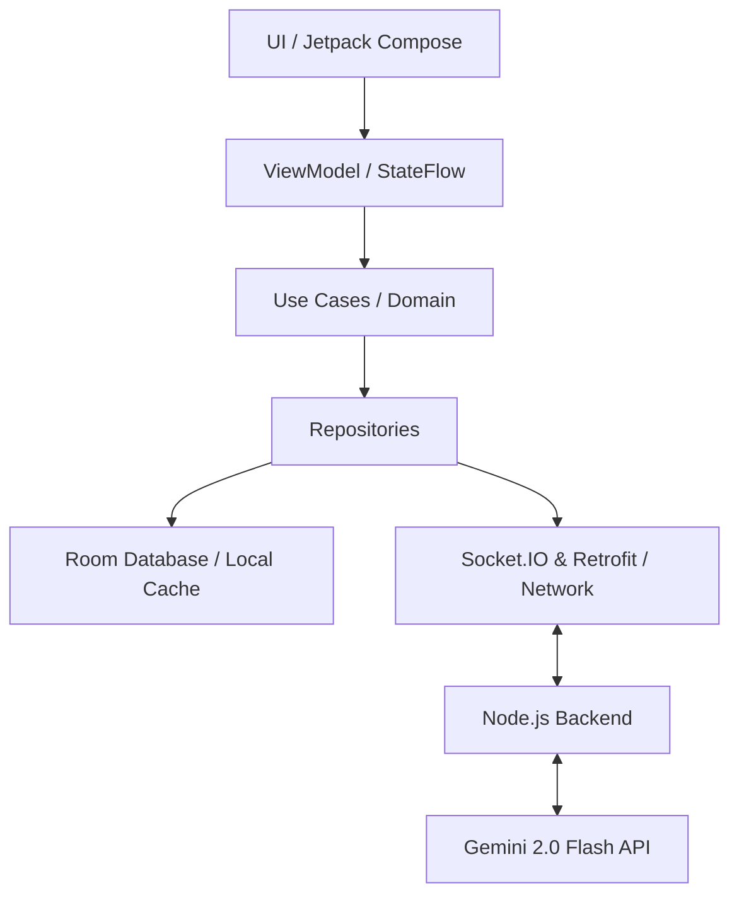
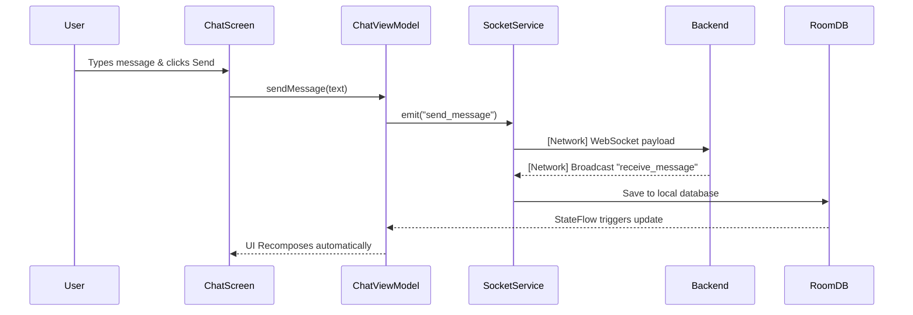
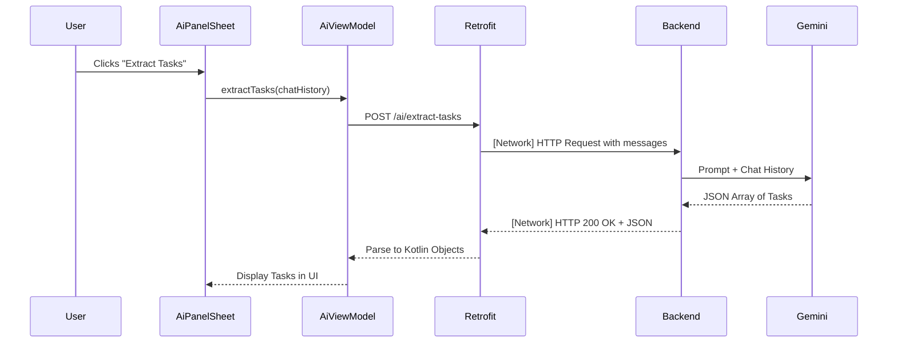

# AI Chat + Tasks 🚀

A real-time messaging application with integrated AI features. Built with a modern Android stack (Kotlin, Jetpack Compose, Clean Architecture) and a Node.js backend powered by Gemini 2.0 Flash.

## 🌟 Overview

This app allows users to chat in real-time and leverage AI to be more productive. The AI can summarize long conversations, answer questions about the chat history, and automatically extract tasks/todos from messages.

---

## 🏗️ Architecture & Libraries

This project follows **Clean Architecture** principles and the **MVVM (Model-View-ViewModel)** pattern. 

### Core Architecture Flow


### Libraries Used

| Component | Library / Tech | Purpose |
| :--- | :--- | :--- |
| **UI** | Jetpack Compose | Modern declarative UI toolkit for Android. |
| **Architecture** | MVVM & StateFlow | Managing UI state reactively. |
| **Dependency Injection** | Dagger Hilt `2.60.1` | Providing dependencies (like repositories) to ViewModels. |
| **Navigation** | Navigation3 API | Type-safe, modern screen navigation. |
| **Local Database** | Room Database | Caching chat history and saving extracted tasks locally. |
| **Real-time Network** | Socket.IO Client | Maintaining an open WebSocket connection for instant messaging. |
| **REST Network** | Retrofit 2 | Making standard HTTP POST requests for AI analysis. |
| **Backend Server** | Node.js + Express | Handling connections, broadcasting messages, and securely querying Google's AI. |
| **AI Model** | Google `@google/genai` | Utilizing Gemini 2.0 Flash for blazing-fast text analysis. |

---

## 🔄 App Flow (For Junior Devs)

Understanding how data moves through this app is the key to understanding the codebase.

### 1. Sending a Chat Message (The Socket Flow)

* **Step 1:** The user types a message in `ChatScreen`.
* **Step 2:** The `ChatViewModel` catches this and tells the `ChatRepository` to send it.
* **Step 3:** The `SocketService` fires the message over the network to the Node.js backend.
* **Step 4:** The backend broadcasts the message to everyone (including the sender).
* **Step 5:** The Android app receives the broadcast, saves the message to **Room**, and the UI updates automatically because it is observing the database via a `StateFlow`.

### 2. Using the AI (The Task Extraction Flow)

* **Step 1:** The user opens the AI Panel and requests task extraction.
* **Step 2:** The `AiViewModel` gathers the recent chat history and makes a standard HTTP POST request via **Retrofit**.
* **Step 3:** The Node.js backend receives the request and constructs a prompt for **Gemini 2.0 Flash**.
* **Step 4:** Gemini analyzes the chat and returns a structured JSON array.
* **Step 5:** The backend forwards the JSON back to Android, which parses it into Kotlin data classes (`Task`) and displays them for the user to save.

---

## 🛠️ Setup Instructions

### 1. Setup the Backend
1. Open a terminal and navigate to the `backend` folder:
   ```bash
   cd backend
   ```
2. Install the dependencies:
   ```bash
   npm install
   ```
3. Get a free Gemini API Key from [Google AI Studio](https://aistudio.google.com/apikey).
4. Create a `.env` file in the `backend` folder and add your key:
   ```env
   GEMINI_API_KEY=AIzaSy_your_api_key_here
   PORT=3000
   ```
5. Start the server:
   ```bash
   npm run dev
   ```

### 2. Setup the Android App
1. Open **Android Studio**.
2. Select **File > Open** and choose the `android` folder inside this repository.
3. Let Gradle sync and download all dependencies (this may take a few minutes).
4. *Important*: Ensure your Android emulator or physical device is running.
5. Click the **Run (▶️)** button in Android Studio to install and launch the app.

*(Note: The app expects the backend to be running on `http://10.0.2.2:3000` which is the default localhost alias for Android emulators. If testing on a physical device, update the BASE_URL in `NetworkModule.kt` to your computer's local IP address).*
